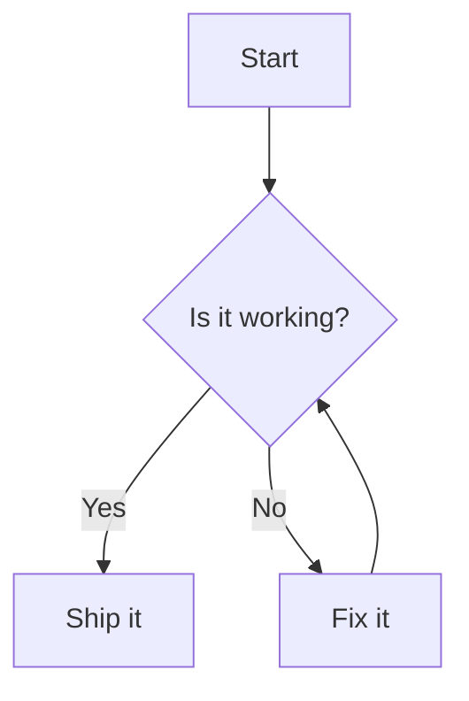
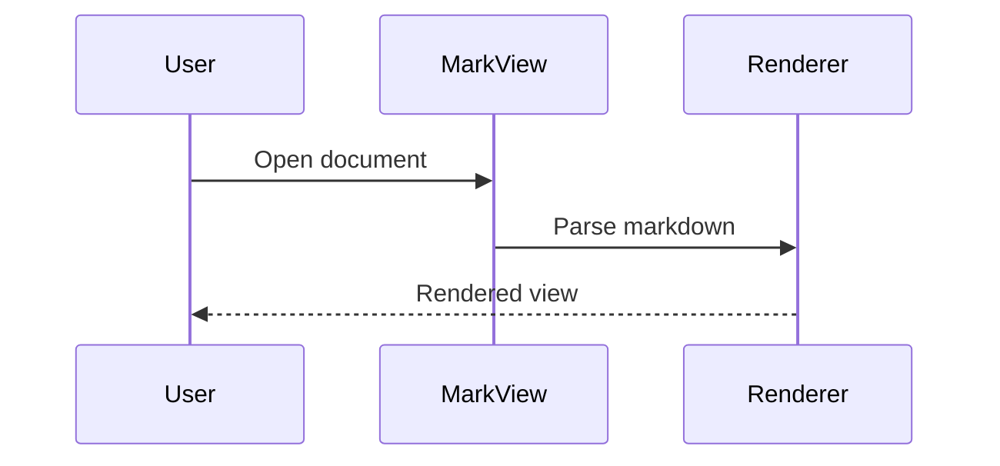

# Mermaid Diagram Sample

In the app, Mermaid blocks show as a labeled source block. Export to HTML
(or Print via Browser / PDF) to see them rendered as diagrams.

## Flowchart



## Sequence diagram



## Regular code (not a diagram)

```go
fmt.Println("this stays a normal code block")
```
